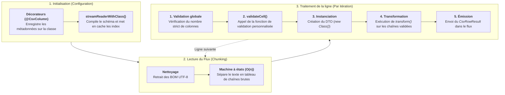

# csv-airstream

*[Read this documentation in English](README.md)*

Une bibliothèque de traitement de flux (streaming) CSV ultra-légère, sans aucune dépendance.
Conçue pour traiter des volumes massifs de données sur Node.js, Deno, Bun et les navigateurs modernes, sans provoquer de pics de mémoire (OOM).

## Pourquoi choisir csv-airstream ?

* **API Standard Web Streams** : Fonctionne nativement dans le navigateur et sur les serveurs (Node.js, Edge) sans nécessiter de polyfills ou d'adaptateurs externes.

* **Typage Magique (DTO Decorators)** : Liez des en-têtes CSV complexes (ex: `nom *`, `actif (0,1)`) directement à vos classes TypeScript grâce aux décorateurs `@CsvColumn` et `@CsvIndex`.

* **Détection Automatique (Sniffing)** : Le mode `"auto"` devine intelligemment le séparateur (virgule, point-virgule, tabulation...) en analysant les premières lignes.

* **Zéro Crash (Result Pattern)** : Au lieu de faire planter votre application à la première erreur, le flux retourne un objet explicite `{ ok: true, data }` ou `{ ok: false, error }` ligne par ligne.

* **Export Simplifié** : Des fonctions utilitaires intégrées pour sauvegarder directement sur votre disque (`saveToFile`) ou déclencher un téléchargement HTTP (`toResponse`).

* **Respect du standard (RFC 4180)** : Gère nativement les cellules sur plusieurs lignes, les guillemets échappés et les entêtes BOM UTF-8.

> **NOTE pour les pros (Performances & Mémoire)** :
`csv-airstream` ne met jamais l'intégralité du fichier en mémoire tampon. De plus, le mapping des colonnes (Schema Resolution) n'est calculé qu'une seule fois au démarrage. Ensuite, chaque ligne lue ou écrite utilise des accès par indexation en O(1) (Zéro Overhead), garantissant une vitesse fulgurante même sur des fichiers de plusieurs gigaoctets.

## Installation
```bash
npm install @jetonpeche/csv-airstream
```

## Architecture & Cycle de vie (Lifecycle)
Afin de garantir des performances optimales et une empreinte mémoire minimale, `csv-airstream` sépare strictement la phase de configuration de la phase de traitement par flux.  
Voici l'ordre exact d'exécution lorsque vous utilisez `streamReaderWithClass` :



### Détails importants
- Les décorateurs sont lus une seule fois au démarrage. Les fonctions `transform` sont mises en cache.
- `validateCell` est toujours appelée avant l'instanciation de la classe et avant la transformation. Elle reçoit toujours la valeur brute (chaîne de caractères).
- `transform` n'est exécutée que si la cellule a passé l'étape de validation avec succès. Le résultat est directement injecté dans la nouvelle instance du DTO.

## Démarrage Rapide

### Mapping Facile avec des Classes (DTO)
Transformez vos lignes CSV directement en objets TypeScript propres et validés.   

```ts
import { Csv, CsvColumn } from "@jetonpeche/csv-airstream";

class UserDto 
{
    // Cherche la colonne exacte "name *" dans le CSV
    @CsvColumn("name *", { required: true, order: 0 })
    name!: string;

    @CsvColumn("is active (0, 1) *", { order: 1 })
    isActive!: string;
}

const csvData = `name *;is active (0, 1) *
Jane Doe;1`;

// LECTURE : Le mode "auto" devine que le séparateur est le point-virgule
for await (const row of Csv.streamReaderWithClass(csvData, UserDto, { delimiter: "auto" })) 
{
    if (row.ok)
        console.log(`Utilisateur: ${row.data.name}, Actif: ${row.data.isActive}`);
}

// ÉCRITURE : Génère automatiquement les entêtes dans le bon ordre (order: 0, 1)
const writer = Csv.streamWriterWithClass(UserDto, { delimiter: ";" });

await writer.write({ name: "Jane Doe", isActive: "1" });
await writer.close();
```

### Fichiers sans En-tête (Headerless) avec @CsvIndex
Si votre fichier CSV n'a pas de ligne d'en-tête, vous pouvez lier vos propriétés directement à la position de la colonne (0, 1, 2...).

```ts
import { Csv, CsvIndex } from "@jetonpeche/csv-airstream";

class LogEntryDto 
{
    @CsvIndex(0, { required: true }) 
    timestamp!: string;

    @CsvIndex(1) 
    level!: string;

    @CsvIndex(2) 
    message!: string;
}

const rawLogs = `2026-10-06T08:00:00Z,INFO,Serveur démarré
2026-10-06T08:00:01Z,WARN,Pic de mémoire détecté`;

for await (const row of Csv.streamReaderWithClass(rawLogs, LogEntryDto)) 
{
    if (row.ok) 
        console.log(`[${row.data.level}] ${row.data.message}`);
}
```

### Lecture brute (Sans Typage)
Pour lire un fichier rapidement sans créer de classe au préalable. 

```ts
import { Csv } from "@jetonpeche/csv-airstream";

const rawCsv = `id,name,price
1,Clavier,49.99
2,"Souris sans fil",24.50`;

for await (const row of Csv.streamReader(rawCsv, { hasHeader: true })) 
{
    if (row.ok) 
        console.log(`Ligne ${row.line}: ${row.data.name} (${row.data.price}€)`);
}
```

### Transformations Personnalisées (Custom Transforms)
Vous pouvez transformer à la volée n'importe quelle valeur brute en tableau, date ou objet complexe grâce à l'option `transform` directement dans le décorateur.

```ts
import { Csv, CsvColumn } from "@jetonpeche/csv-airstream";

class ProductDto 
{
    @CsvColumn("name") name!: string;

    // Convertit "rouge|bleu|vert" en tableau ["rouge", "bleu", "vert"]
    @CsvColumn("colors", { transform: (val) => val.split("|").map(c => c.trim()) })
    colors!: string[];

    // Applique un format de date personnalisé
    @CsvColumn("created_at", { transform: (val) => new Date(val).toISOString() })
    createdAt!: string;
}

const csvData = `name,colors,created_at
T-Shirt,rouge|bleu,2026-10-06T10:00:00Z`;

for await (const row of Csv.streamReaderWithClass(csvData, ProductDto)) 
{
     // Affiche le tableau JavaScript
    if (row.ok)
        console.log(row.data.colors);
}
```

> Astuce : Vous pouvez aussi surcharger ces transformations au moment de l'exécution (sans modifier la classe) en passant l'option `transformers: new Map(...)` dans `Csv.streamReaderWithClass()`.

## Exemple Complet : Nettoyage de données
Voici un scénario réaliste : un fichier d'inventaire arrive très mal formaté (commentaires, séparateurs aléatoires, valeurs incorrectes). Nous allons le lire, le valider, et réécrire un fichier propre sur le disque dur.

```ts
import { Csv, CsvColumn } from "@jetonpeche/csv-airstream";

class InventoryItemDto 
{
    @CsvColumn("product sku #", { required: true, order: 0 }) 
    sku!: string;

    @CsvColumn("product name *", { required: true, order: 1 }) 
    name!: string;

    @CsvColumn("unit price (usd)", { required: true, order: 2 }) 
    price!: string;

    @CsvColumn("in stock", { order: 3 }) 
    stock!: string;
}

// Un fichier CSV sale : entête BOM, commentaires (#), lignes incomplètes
const dirtyCsv = `\uFEFF# Export Inventaire Lot 42
# Date: 2026-10-06
product name *;product sku #;unit price (usd);in stock
Clavier Mécanique;TECH-101;129.99;15
Souris Sans Fil;TECH-202;39.50;50
;TECH-303;-10.00;0
Ecran 27";DISP-404;249.00;8`;

async function runInventoryPipeline() 
{
    // Lit et on valide les données à la volée
    const reader = Csv.streamReaderWithClass(dirtyCsv, InventoryItemDto, {
        delimiter: "auto", // Trouve le point-virgule tout seul !
        comment: "#",      // Ignore les lignes commençant par #
        trim: true,        // Retire les espaces superflus
        strictColumnCount: true,
        validateCell: (value, { columnName }) => 
        {
            // Règle personnalisée : on refuse les prix négatifs
            if (columnName === "unit price (usd)" && Number(value) < 0) 
                return "PRIX_NEGATIF_INTERDIT";

            return true;
        }
    });

    // Prépare le flux pour écrire un fichier tout propre
    const writer = Csv.streamWriterWithClass(InventoryItemDto, { delimiter: "," });
    const savePromise = Csv.saveToFile(writer, "./clean_inventory.csv");

    let successCount = 0;
    let failureCount = 0;

    // Fait passer les données d'un flux à l'autre
    for await (const row of reader) 
    {
        if (row.ok) 
        {
            await writer.write(row.data);
            successCount++;
        } 
        else 
        {
            failureCount++;
            console.warn(`Ligne ${row.line} ignorée [${row.error.code}]: ${row.error.message}`);
        }
    }

    await writer.close();
    await savePromise;

    console.log(`Terminé : ${successCount} exportés, ${failureCount} rejetés.`);
}

runInventoryPipeline();
```

## Utilisation dans le navigateur (Frontend)
Lisez des fichiers géants directement depuis le navigateur de l'utilisateur sans faire planter l'onglet, grâce à l'API native `File.stream()` :
```js
document.getElementById('csvFileInput').addEventListener('change', async (event) => 
{
    const file = event.target.files[0];
    if (!file) 
        return;

    // file.stream() retourne un ReadableStream natif, parfait pour csv-airstream !
    for await (const row of Csv.streamReader(file.stream(), { hasHeader: true })) 
    {
        if (row.ok)
            console.log("Ligne lue :", row.data);
    }
});
```

## Gestion des erreurs
```ts
try 
{
    for await (const row of Csv.streamReaderWithClass(stream, UserDto)) 
    {
        if (row.ok) 
            console.log(row.data);
    }
} 
catch (error) 
{
    // Intercepte les erreurs critiques du flux (ex: fichier introuvable, coupure réseau)
    console.error("Le flux a été interrompu :", error);
}
```

## Export de Fichiers & Web

### Sauvegarder sur le disque (Node.js)
```ts
import { Csv, CsvColumn } from "@jetonpeche/csv-airstream";

class ExportDto 
{
    CsvColumn("ID", { order: 0 }) 
    id!: string;

    @CsvColumn("Titre", { order: 1 }) 
    title!: string;
}

const writer = Csv.streamWriterWithClass(ExportDto);

// Utilise les flux du système de fichiers
const fileSave = Csv.saveToFile(writer, "./exports/rapport.csv"); 

await writer.write({ id: "1", title: "Traitement de flux" });
await writer.write({ id: "2", title: 'Guillemets "échappés"' });
await writer.close();

// Attend que le fichier soit totalement écrit
await fileSave; 
```

### Téléchargement HTTP (Next.js, Cloudflare, Express...)
Créez instantanément une réponse API (Response) prête à être téléchargée par l'utilisateur.   

```ts
import { Csv, CsvColumn } from "@jetonpeche/csv-airstream";

class CustomerDto
{
    @CsvColumn("id_client") 
    id!: string;

    @CsvColumn("nom_complet") 
    name!: string;
}

export async function GET() 
{
    const writer = Csv.streamWriterWithClass(CustomerDto);

    // Lance l'écriture en arrière-plan
    (async () => {
        await writer.write({ id: "101", name: "Alice Dupont" });
        await writer.write({ id: "102", name: "Bob Martin" });
        await writer.close();
    })();

    // Retourne une Response Web standard avec les bons headers (Content-Disposition)
    return Csv.toResponse(writer, "clients.csv");
}
```

## Référence de l'API

### Décorateurs
`@CsvColumn(header, options?)`: Lie une propriété à un texte d'en-tête.

* `header` *(string)* : Le nom de la colonne dans le CSV source.
* `options.required` *(boolean)* : Si `true`, rejette la ligne si la cellule est vide.
* `options.order`*(number)*: L'ordre d'affichage de la colonne lors de l'export (ex: 0, 1, 2).
* `options.type`*("`string" \| "number" \| "boolean" \| "date"`)*:  Conversion automatique des valeurs primitives.
* `options.transform` *`(value: string) => any`*: Fonction de conversion personnalisée exécutée à chaque cellule.

`@CsvIndex(index, options?)`: Lie une propriété à une position numérique.   
* `index` *(number)* : La position de la colonne (commence à 0).   
* `options.required` *(boolean)* : Si `true`, rejette la ligne si la cellule est vide. 

### Les Méthodes Typées (DTO)
`Csv.streamReaderWithClass(source, dtoClass, options?)`  
Lit et transforme le CSV en instances de votre classe.  
* Active automatiquement les entêtes (`hasHeader: true`).   
* Applique automatiquement les champs requis. 

`Csv.streamWriterWithClass(dtoClass, options?)`  
Crée un flux d'écriture configuré par votre classe.

* `options.columnsOrder` *(array)* : Permet de forcer un ordre de colonnes différent au moment de l'export.   
* `options.alwaysQuote`*(boolean)* : Force l'ajout de guillemets autour de chaque cellule.

### Les Utilitaires d'Export
* `Csv.saveToFile(writer, filePath)` : Sauvegarde votre flux directement sur le disque (idéal pour Node/Bun/Deno).
* `Csv.toResponse(writer, filename)` : Convertit le flux en téléchargement pour navigateur (idéal pour les APIs).

## License
MIT