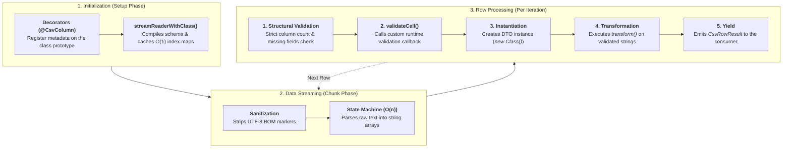

# csv-airstream

*[Documentation en français](https://github.com/jetonpecheCorp/csv-airstream/blob/main/README.fr.md)*

An ultra-lightweight CSV streaming library with zero dependencies.
Designed to process massive volumes of data on Node.js, Deno, Bun, and modern browsers without causing memory spikes (OOM).

## Why choose csv-airstream ?

* **Standard Web Streams API**: Works natively in browsers and on servers (Node.js, Edge) without requiring polyfills or external adapters.

* **Magic Typing (DTO Decorators)**: Bind complex CSV headers (e.g., `name *`, `active (0,1)`) directly to your TypeScript classes using `@CsvColumn` and `@CsvIndex` decorators.

* **Automatic Detection (Sniffing)**: `"auto"` mode intelligently guesses the delimiter (comma, semicolon, tab, etc.) by analyzing the first few lines.

* **Zero Crashes (Result Pattern)**: Instead of crashing your application on the first error, the stream returns an explicit object—`{ ok: true, data }` or `{ ok: false, error }`—for each line.

* **Simplified Export**: Built-in utility functions to save directly to disk (`saveToFile`) or trigger an HTTP download (`toResponse`).

* **Standard Compliance (RFC 4180)**: Natively handles multi-line cells, escaped quotes, and UTF-8 BOM headers.

> **NOTE for Pros (Performance & Memory)**:
`csv-airstream` never buffers the entire file in memory. Furthermore, column mapping (Schema Resolution) is calculated only once at startup. Subsequently, every line read or written uses O(1) index-based access (zero overhead), ensuring blazing-fast speeds even with multi-gigabyte files.

## Setup
```bash
npm install @jetonpeche/csv-airstream
```

## Architecture & Lifecycle
To guarantee optimal performance and a minimal memory footprint, `csv-airstream` strictly separates the schema compilation phase from the actual stream processing.  
Here is the exact execution order when using `streamReaderWithClass`:



### Key takeaways
- Decorators are evaluated only once at startup. The `transform` functions are cached.
- `validateCell` is always called before class instantiation and before transformations. It always receives the raw string value.
- `transform` is only executed if the cell passes the validation step. The returned value is then directly injected into the newly created DTO instance.

## Quick start

### Easy mapping with Classes (DTO)
Transform your CSV lines directly into clean, validated TypeScript objects.

```ts
import { Csv, CsvColumn } from "@jetonpeche/csv-airstream";

class UserDto 
{
    // Look for the exact column "name *" in the CSV.
    @CsvColumn("name *", { required: true, order: 0 })
    name!: string;

    @CsvColumn("is active (0, 1) *", { order: 1 })
    isActive!: string;
}

const csvData = `name *;is active (0, 1) *
Jane Doe;1`;

// READING: "Auto" mode guesses that the separator is the semicolon.
for await (const row of Csv.streamReaderWithClass(csvData, UserDto, { delimiter: "auto" })) 
{
    if (row.ok)
        console.log(`user: ${row.data.name}, Active: ${row.data.isActive}`);
}

// WRITING: Automatically generates headers in the correct order (order: 0, 1)
const writer = Csv.streamWriterWithClass(UserDto, { delimiter: ";" });

await writer.write({ name: "Jane Doe", isActive: "1" });
await writer.close();
```

### Headerless files with `@CsvIndex`
If your CSV file does not have a header row, you can map your properties directly to the column position (0, 1, 2...).

```ts
import { Csv, CsvIndex } from "@jetonpeche/csv-airstream";

class LogEntryDto 
{
    @CsvIndex(0, { required: true }) 
    timestamp!: string;

    @CsvIndex(1) 
    level!: string;

    @CsvIndex(2) 
    message!: string;
}

const rawLogs = `2026-10-06T08:00:00Z,INFO,Server started
2026-10-06T08:00:01Z,WARN,Memory leak detected`;

for await (const row of Csv.streamReaderWithClass(rawLogs, LogEntryDto)) 
{
    if (row.ok) 
        console.log(`[${row.data.level}] ${row.data.message}`);
}
```

### Raw Read (Untyped)
To read a file quickly without creating a class beforehand.

```ts
import { Csv } from "@jetonpeche/csv-airstream";

const rawCsv = `id,name,price
1,Keyboard,49.99
2,"Mouse wireless",24.50`;

for await (const row of Csv.streamReader(rawCsv, { hasHeader: true })) 
{
    if (row.ok) 
        console.log(`Line ${row.line}: ${row.data.name} ($${row.data.price})`);
}
```

### Custom Data Transformations
You can mutate raw string values into complex structures (like Arrays or Dates) on the fly using the `transform` option right inside the decorator.

```ts
import { Csv, CsvColumn } from "@jetonpeche/csv-airstream";

class ProductDto 
{
    @CsvColumn("name") name!: string;

    // Parses "red|blue|green" into a JavaScript Array
    @CsvColumn("colors", { transform: (val) => val.split("|").map(c => c.trim()) })
    colors!: string[];

    // Applies custom date parsing logic
    @CsvColumn("created_at", { transform: (val) => new Date(val).toISOString() })
    createdAt!: string;
}

const csvData = `name,colors,created_at
T-Shirt,red|blue,2026-10-06T10:00:00Z`;

for await (const row of Csv.streamReaderWithClass(csvData, ProductDto)) 
{
    // Safely logs the parsed Array !
    if (row.ok)
        console.log(row.data.colors);
}
```

> **Tip**: You can also override these transformers at runtime (without changing the class) by passing the `transformers: new Map(...)` option into `Csv.streamReaderWithClass()`.

## Complete Example: Data Cleaning
Here is a realistic scenario: an inventory file arrives in a very poorly formatted state (comments, random separators, incorrect values). We will read it, validate it, and write a clean file back to the hard drive.

```ts
import { Csv, CsvColumn } from "@jetonpeche/csv-airstream";

class InventoryItemDto 
{
    @CsvColumn("product sku #", { required: true, order: 0 }) 
    sku!: string;

    @CsvColumn("product name *", { required: true, order: 1 }) 
    name!: string;

    @CsvColumn("unit price (usd)", { required: true, order: 2 }) 
    price!: string;

    @CsvColumn("in stock", { order: 3 }) 
    stock!: string;
}

// A dirty CSV file: BOM header, comments (#), incomplete lines
const dirtyCsv = `\uFEFF# Export inventory number 42
# Date: 2026-10-06
product name *;product sku #;unit price (usd);in stock
Mecanic keyboard;TECH-101;129.99;15
Mouse wireless;TECH-202;39.50;50
;TECH-303;-10.00;0
Screen 27";DISP-404;249.00;8`;

async function runInventoryPipeline() 
{
    // We read and validate the data on the fly.
    const reader = Csv.streamReaderWithClass(dirtyCsv, InventoryItemDto, {
        delimiter: "auto", // Find the semicolon all by yourself!
        comment: "#",      // Ignore lines starting with #
        trim: true,        // Remove any unnecessary spaces
        strictColumnCount: true,
        validateCell: (value, { columnName }) => 
        {
            // Custom rule: negative prices are rejected.
            if (columnName === "unit price (usd)" && Number(value) < 0) 
                return "NEGATIVE_PRICE_PROHIBITED";

            return true;
        }
    });

    // Prepares the stream to write a clean file.
    const writer = Csv.streamWriterWithClass(InventoryItemDto, { delimiter: "," });
    const savePromise = Csv.saveToFile(writer, "./clean_inventory.csv");

    let successCount = 0;
    let failureCount = 0;

    // Passes data from one stream to another
    for await (const row of reader) 
    {
        if (row.ok) 
        {
            await writer.write(row.data);
            successCount++;
        } 
        else 
        {
            failureCount++;
            console.warn(`Line ${row.line} ignored [${row.error.code}]: ${row.error.message}`);
        }
    }

    await writer.close();
    await savePromise;

    console.log(`Finish : ${successCount} exported, ${failureCount} rejected.`);
}

runInventoryPipeline();
```

## Browser usage (Frontend)
Read huge files directly from the user's browser without crashing the tab, thanks to the native `File.stream()` API:
```js
document.getElementById('csvFileInput').addEventListener('change', async (event) => 
{
    const file = event.target.files[0];
    if (!file) 
        return;

    // file.stream() returns a native ReadableStream, perfect for csv-airstream !
    for await (const row of Csv.streamReader(file.stream(), { hasHeader: true })) 
    {
        if (row.ok)
            console.log("Ligne lue :", row.data);
    }
});
```

## Gestion des erreurs
```ts
try 
{
    for await (const row of Csv.streamReaderWithClass(stream, UserDto)) 
    {
        if (row.ok) 
            console.log(row.data);
    }
} 
catch (error) 
{
    // Intercepts critical stream errors (e.g., file not found, network outage)
    console.error("The stream has been interrupted:", error);
}
```

## File Export & Web

### Save to disk (Node.js)
```ts
import { Csv, CsvColumn } from "@jetonpeche/csv-airstream";

class ExportDto 
{
    CsvColumn("ID", { order: 0 }) 
    id!: string;

    @CsvColumn("Titre", { order: 1 }) 
    title!: string;
}

const writer = Csv.streamWriterWithClass(ExportDto);

// Uses file system streams
const fileSave = Csv.saveToFile(writer, "./exports/report.csv"); 

await writer.write({ id: "1", title: "Stream processing" });
await writer.write({ id: "2", title: '"Escaped" quotation marks' });
await writer.close();

// Wait for the file to be fully written.
await fileSave; 
```

### Download HTTP (Next.js, Cloudflare, Express...)
Instantly create an API response ready for the user to download.

```ts
import { Csv, CsvColumn } from "@jetonpeche/csv-airstream";

class CustomerDto
{
    @CsvColumn("client_id") 
    id!: string;

    @CsvColumn("full_name") 
    name!: string;
}

export async function GET() 
{
    const writer = Csv.streamWriterWithClass(CustomerDto);

    // Starts writing in the background
    (async () => {
        await writer.write({ id: "101", name: "Alice Dupont" });
        await writer.write({ id: "102", name: "Bob Martin" });
        await writer.close();
    })();

    // Returns a standard Web Response with the correct headers (Content-Disposition).
    return Csv.toResponse(writer, "clients.csv");
}
```

## API References

### Decorators
`@CsvColumn(header, options?)`: Binds a property to a header text.  
* `header` *(string)* : The name of the column in the source CSV.
* `options.required` *(boolean)* : If `true`, rejects the row if the cell is empty.
* `options.order`*(number)*: The display order of the column during export (e.g., 0, 1, 2).
* `options.type` *(`"string" \| "number" \| "boolean" \| "date"`)*: Built-in automatic primitive casting.
*  `options.transform` *(`(value: string) => any`)* : Custom callback converting a raw cell string into a typed value.

`@CsvIndex(index, options?)`: Binds a property to a numerical position.  
* `index` *(number)* : The column position (starts at 0).   
* `options.required` *(boolean)* : If `true`, rejects the row if the cell is empty.

### Typed Methods (DTOs)
`Csv.streamReaderWithClass(source, dtoClass, options?)`  
Reads the CSV and transforms it into instances of your class.
* Automatically enables headers (`hasHeader: true`).   
* Automatically applies the required fields.

`Csv.streamWriterWithClass(dtoClass, options?)`  
Creates a writing stream configured by your class.

* `options.columnsOrder` *(array)* : Allows you to force a different order of columns at the time of export.
* `options.alwaysQuote`*(boolean)* :Forces the addition of quotation marks around each cell.

### Export Utilities
* `Csv.saveToFile(writer, filePath)` : Saves your stream directly to disk (ideal for Node/Bun/Deno).
* `Csv.toResponse(writer, filename)` : Converts the stream into a browser download (ideal for APIs).

## License
MIT